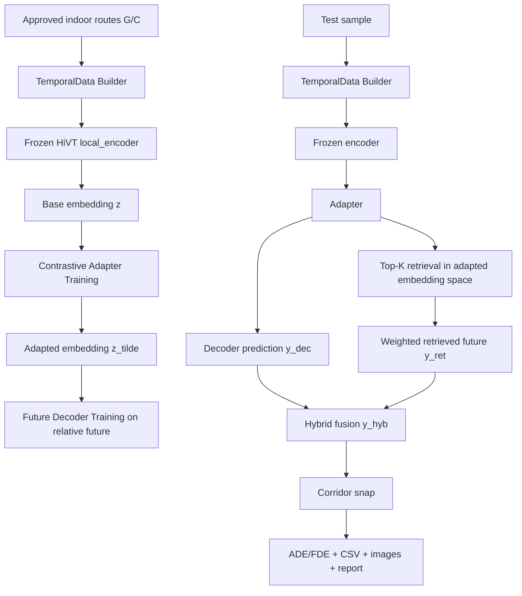

# گزارش کامل روش Contrastive + Decoder + Hybrid برای پیش‌بینی مسیرهای دانشکده

## 1) هدف
این گزارش، نسخه جدید و مستقل پیش‌بینی مسیر را مستند می‌کند که سه جزء را با هم ترکیب می‌کند:

1. **HiVT Encoder (فریز شده)** برای استخراج embedding از مسیرهای indoor
2. **Contrastive Domain Adaptation Adapter** برای سازگار کردن embedding با domain راهروهای دانشکده
3. **Future Decoder + Hybrid Retrieval** برای تولید مسیر آینده با کیفیت بهتر

این جریان در فایل [Code/EngineeringDepartment/hivt_contrastive_decoder_predictor.py](Code/EngineeringDepartment/hivt_contrastive_decoder_predictor.py) پیاده‌سازی شده و **هیچ فایل قبلی را دستکاری نمی‌کند**.

---

## 2) داده و تقسیم‌بندی

- مجموعه مسیرها: **48 مسیر تاییدشده**
  - G001-G020
  - C001-C028
- هر مسیر: 50 نقطه
  - 20 نقطه تاریخچه (`HIST_STEPS=20`)
  - 30 نقطه آینده (`FUTURE_STEPS=30`)
- طول مشاهده تست: `[12,16,20]`
- تقسیم train/test در سطح route_id:
  - train routes: 38
  - test routes: 10
- تعداد نمونه‌ها:
  - train samples: 114
  - test samples: 30

---

## 3) معماری کامل روش (End-to-End)



---

## 4) تعریف دقیق متغیرها

| متغیر | شکل | توضیح |
|---|---|---|
| `positions` | `[N,50,2]` | مسیر مطلق actorها در فضای متری local |
| `x` | `[N,20,2]` | تاریخچه نسبی (`delta`) |
| `y` | `[N,30,2]` | آینده نسبی نسبت به گام 20 |
| `lane_vectors` | `[L,2]` | بردارهای محور corridor |
| `lane_actor_index` | `[2,E]` | اتصال lane به actor |
| `z` | `[D]` | embedding خروجی encoder (`D=64`) |
| `z_tilde` | `[D]` | embedding بعد از adapter |
| `y_dec` | `[30,2]` | خروجی decoder (آینده نسبی) |
| `y_ret` | `[30,2]` | آینده نسبی بازیابی‌شده از retrieval |
| `y_hyb` | `[30,2]` | خروجی هیبریدی |
| `alpha` | scalar | وزن decoder در ترکیب هیبریدی |
| `tau` | scalar | دمای softmax برای وزن‌دهی retrieval |

---

## 5) فرمول‌های کلیدی

### 5.1 نگاشت encoder
$$z_i = \phi_{HiVT}(x_i)$$

### 5.2 adaptation
$$\tilde{z}_i = z_i + g_\theta(z_i)$$

### 5.3 retrieval distance
$$d_j = 1 - \cos(\tilde{z}_{query}, \tilde{z}_j)$$

### 5.4 retrieval probability
$$p_j = \frac{\exp(-d_j/\tau)}{\sum_k \exp(-d_k/\tau)}$$

### 5.5 آینده بازیابی‌شده
$$\hat{y}_{ret} = \sum_{j \in TopK} p_j\,\hat{y}_{ret,j}$$

### 5.6 ترکیب هیبریدی
$$\hat{y}_{hyb} = \alpha\hat{y}_{dec} + (1-\alpha)\hat{y}_{ret}$$

### 5.7 قید هندسی نهایی
$$\hat{y}_{final} = SnapToCorridor(\hat{y}_{hyb})$$

---

## 6) تنظیمات آموزش اجراشده

- Adapter epochs: 8
- Decoder epochs: 20
- Batch size: 64
- Margin (triplet): 0.2
- Reg lambda: 0.05
- Retrieval top-k: 6
- Retrieval tau: 0.05
- Hybrid alpha: 0.35
- Seed: 2026

---

## 7) نتایج عددی (Held-out Test Routes)

### 7.1 میانگین کل

| معیار | مقدار (m) |
|---|---:|
| mean ADE raw | 41.099 |
| mean FDE raw | 62.925 |
| mean ADE decoder-snapped | 38.619 |
| mean FDE decoder-snapped | 61.127 |
| mean ADE hybrid-snapped | 35.184 |
| mean FDE hybrid-snapped | 58.593 |

### 7.2 بهبود Hybrid نسبت به Decoder-snapped

- بهبود ADE: `38.619 -> 35.184` (کاهش 3.435m)
- بهبود FDE: `61.127 -> 58.593` (کاهش 2.534m)

### 7.3 تحلیل به‌ازای طول مشاهده

| obs_len | ADE decoder | ADE hybrid | FDE decoder | FDE hybrid |
|---:|---:|---:|---:|---:|
| 12 | 38.660 | 36.450 | 61.140 | 61.100 |
| 16 | 38.580 | 35.540 | 61.120 | 59.680 |
| 20 | 38.620 | 33.550 | 61.120 | 55.000 |

### 7.4 تعداد caseهای بهبود یافته

- تعداد کل case: 30
- ADE بهتر شده در: 22 case
- FDE بهتر شده در: 19 case

---

## 8) تفسیر نتیجه

1. **افزایش زمان مشاهده مفید است**: در `obs=20` بهبود Hybrid نسبت به Decoder بیشتر شده است.
2. **Hybrid پایدارتر از Decoder-only**: به طور میانگین هم ADE و هم FDE بهتر شده‌اند.
3. **Snap کافی نیست**: قید هندسی کمک می‌کند، اما خطای معنایی انتخاب مسیر هنوز در برخی caseها بالاست.
4. **Domain adaptation اثر مثبت داشته**: Adapter توانسته فاصله embedding را برای retrieval بهتر سازماندهی کند.

---

## 9) بهترین‌ها و بدترین‌ها

### 9.1 بهترین caseها (Hybrid)
- `G014` در obs=12/16/20 با FDE بسیار پایین
- `G018` نیز رفتار پایدار و خوب داشته است

### 9.2 بدترین caseها (Hybrid)
- `G008` در هر سه obs هنوز FDE بالا دارد
- `G012` و `C021` نیز در tail distribution خطای بالا نشان می‌دهند

برداشت: این مسیرها احتمالا پوشش مرجع ضعیف‌تر یا ambiguity بالاتری در library دارند.

---

## 10) خروجی‌های تولیدشده

- اسکریپت روش: [Code/EngineeringDepartment/hivt_contrastive_decoder_predictor.py](Code/EngineeringDepartment/hivt_contrastive_decoder_predictor.py)
- CSV نتایج case-level: [Code/EngineeringDepartment/derived/route_workflow/contrastive_decoder/contrastive_decoder_cases.csv](Code/EngineeringDepartment/derived/route_workflow/contrastive_decoder/contrastive_decoder_cases.csv)
- خلاصه کوتاه: [Code/EngineeringDepartment/derived/route_workflow/contrastive_decoder/contrastive_decoder_summary.md](Code/EngineeringDepartment/derived/route_workflow/contrastive_decoder/contrastive_decoder_summary.md)
- این گزارش کامل: [Code/EngineeringDepartment/derived/route_workflow/contrastive_decoder/CONTRASTIVE_DECODER_DETAILED_REPORT_FA.md](Code/EngineeringDepartment/derived/route_workflow/contrastive_decoder/CONTRASTIVE_DECODER_DETAILED_REPORT_FA.md)
- تصاویر تکی: [Code/EngineeringDepartment/derived/route_workflow/contrastive_decoder/images](Code/EngineeringDepartment/derived/route_workflow/contrastive_decoder/images)
- تماس‌شیت: [Code/EngineeringDepartment/derived/route_workflow/contrastive_decoder/predictions_contact_sheet.png](Code/EngineeringDepartment/derived/route_workflow/contrastive_decoder/predictions_contact_sheet.png)
- وزن adapter: [Code/EngineeringDepartment/derived/route_workflow/contrastive_decoder/contrastive_adapter.pt](Code/EngineeringDepartment/derived/route_workflow/contrastive_decoder/contrastive_adapter.pt)
- وزن decoder: [Code/EngineeringDepartment/derived/route_workflow/contrastive_decoder/contrastive_decoder.pt](Code/EngineeringDepartment/derived/route_workflow/contrastive_decoder/contrastive_decoder.pt)

---

## 11) نحوه اجرای بازتولید

```powershell
$env:PYTHONUTF8=1
h:/HadiEnv/KalmanEmdedingSpace/Scripts/python.exe Code/EngineeringDepartment/hivt_contrastive_decoder_predictor.py --adapter-epochs 8 --decoder-epochs 20 --batch-size 64 --hybrid-alpha 0.35 --retrieval-top-k 6 --retrieval-tau 0.05
```

برای آموزش قوی‌تر:

```powershell
$env:PYTHONUTF8=1
h:/HadiEnv/KalmanEmdedingSpace/Scripts/python.exe Code/EngineeringDepartment/hivt_contrastive_decoder_predictor.py --adapter-epochs 25 --decoder-epochs 60 --batch-size 64 --hybrid-alpha 0.30 --retrieval-top-k 6 --retrieval-tau 0.05
```

---

## 12) محدودیت‌ها و گام بعدی

1. test set کوچک است (10 route-id).
2. برای اثبات قوی‌تر، k-fold route-level split پیشنهاد می‌شود.
3. α باید با جستجوی سیستماتیک تنظیم شود (مثلا grid روی 0.1 تا 0.7).
4. افزودن lane-aware decoder (به‌جای MLP ساده) می‌تواند عملکرد را بیشتر بهتر کند.
5. گزارش بعدی بهتر است مقایسه مستقیم 3 baseline را بیاورد:
   - Retrieval-only
   - Decoder-only
   - Hybrid (current)

---

## 13) جمع‌بندی نهایی

روش جدید Contrastive + Decoder + Hybrid توانست روی مجموعه تست نگه‌داشته‌شده:

- خطای میانگین ADE و FDE را نسبت به Decoder-snapped کاهش دهد.
- خروجی تصویری قابل‌تحلیل تولید کند.
- بدون تغییر فایل‌های قبلی، یک مسیر توسعه‌ای امن برای ادامه پژوهش فراهم کند.

این نسخه برای ادامه بهینه‌سازی و گزارش نهایی کاملا آماده است.
