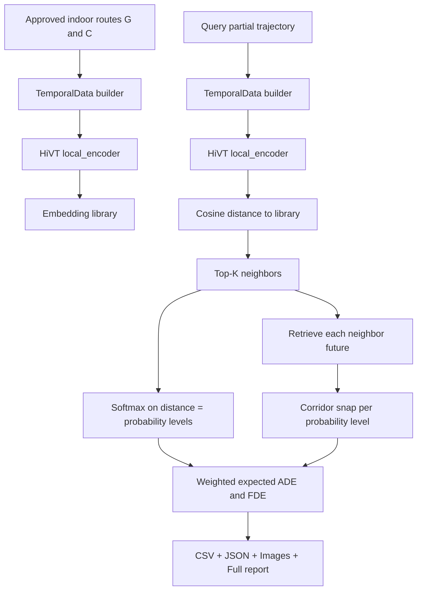

# گزارش جامع احتمالاتی Embedding Space Tracker (HiVT Encoder Only)

## 1) هدف و دامنه
این گزارش، نحوه استفاده دقیق از HiVT در حالت انتقال دانش (Transfer Learning) را مستند می‌کند؛
به‌صورت خاص فقط از encoder برای استخراج embedding استفاده می‌شود و decoder از چرخه پیش‌بینی حذف است.

## 2) معماری و جریان داده (Mermaid)



## 3) تعریف دقیق متغیرها

| متغیر | شکل/نوع | توضیح |
|---|---|---|
| HIST_STEPS | 20 | طول تاریخچه مشاهده |
| FUTURE_STEPS | 30 | افق آینده برای ارزیابی |
| x | [N,20,2] | تاریخچه نسبی (delta position) بازیگران |
| positions | [N,50,2] | موقعیت مطلق کل بازه |
| y | [N,30,2] | آینده نسبی نسبت به گام 20 |
| padding_mask | [N,50] bool | ماسک گام‌های نامشهود |
| bos_mask | [N,20] bool | شروع دنباله معتبر |
| rotate_angles | [N] | زاویه چرخش هر بازیگر |
| lane_vectors | [L,2] | بردارهای محور corridor |
| lane_actor_index | [2,E] | یال lane→actor |
| lane_actor_vectors | [E,2] | بردار نسبی lane به actor |
| local_embed | [N,D] | خروجی encoder (D=64) |
| cos_dist_r | scalar | فاصله کسینوسی Query تا مرجع رتبه r |
| p_r | scalar | احتمال سطح r از softmax(-cos_dist/tau) |
| ADE_r | scalar (m) | میانگین خطای مکانی برای سطح r |
| FDE_r | scalar (m) | خطای نقطه نهایی برای سطح r |
| Expected ADE | scalar (m) | مجموع وزنی: Σ p_r * ADE_r |
| Expected FDE | scalar (m) | مجموع وزنی: Σ p_r * FDE_r |

## 4) فرمول‌های احتمال و خطا

برای رتبه r با فاصله کسینوسی d_r:

$$p_r = \frac{\exp(-d_r/\tau)}{\sum_j \exp(-d_j/\tau)}$$

$$ADE_r = \frac{1}{T} \sum_{t=1}^{T} ||\hat{y}_{r,t} - y_t||_2$$

$$FDE_r = ||\hat{y}_{r,T} - y_T||_2$$

$$Expected\;ADE = \sum_r p_r \cdot ADE_r, \quad Expected\;FDE = \sum_r p_r \cdot FDE_r$$

## 5) پیکربندی اجرا

- تعداد مسیرهای تاییدشده: 48
- طول‌های مشاهده: [12, 16, 20]
- تعداد سطوح احتمال (Top-K): 6
- دمای Softmax (tau): 0.0500
- تعداد کل Case ها: 144

## 6) خلاصه نتایج کل

| معیار | مقدار |
|---|---|
| میانگین Expected ADE (snapped) | 44.08 m |
| میانگین Expected FDE (snapped) | 64.65 m |
| میانگین Top-1 ADE (snapped) | 36.22 m |
| میانگین Top-1 FDE (snapped) | 63.32 m |

## 7) تحلیل خطا به‌ازای سطح احتمال

| Rank | mean probability | mean ADE raw | mean FDE raw | mean ADE snapped | mean FDE snapped |
|---|---|---|---|---|---|
| 1 | 0.2756 | 36.14 | 63.32 | 36.22 | 63.32 |
| 2 | 0.2002 | 42.56 | 65.67 | 42.63 | 65.67 |
| 3 | 0.1657 | 45.99 | 66.01 | 46.03 | 66.01 |
| 4 | 0.1385 | 46.82 | 58.23 | 46.87 | 58.23 |
| 5 | 0.1194 | 52.80 | 67.26 | 52.82 | 67.26 |
| 6 | 0.1006 | 57.39 | 70.84 | 57.40 | 70.84 |

## 8) 10 مورد بهترین Expected FDE

- C026 | obs=20 | best_neighbor=C010 | Expected FDE snapped=8.61 m
- C010 | obs=16 | best_neighbor=C026 | Expected FDE snapped=8.69 m
- C010 | obs=12 | best_neighbor=C026 | Expected FDE snapped=8.78 m
- C026 | obs=16 | best_neighbor=C010 | Expected FDE snapped=8.89 m
- C026 | obs=12 | best_neighbor=C010 | Expected FDE snapped=8.98 m
- G018 | obs=12 | best_neighbor=C026 | Expected FDE snapped=9.06 m
- C010 | obs=20 | best_neighbor=C026 | Expected FDE snapped=10.04 m
- C009 | obs=20 | best_neighbor=C025 | Expected FDE snapped=10.27 m
- C025 | obs=20 | best_neighbor=C009 | Expected FDE snapped=10.33 m
- C009 | obs=16 | best_neighbor=C025 | Expected FDE snapped=10.48 m

## 9) 10 مورد بدترین Expected FDE

- G004 | obs=20 | best_neighbor=G007 | Expected FDE snapped=113.83 m
- G006 | obs=16 | best_neighbor=C007 | Expected FDE snapped=109.66 m
- C017 | obs=20 | best_neighbor=C020 | Expected FDE snapped=106.92 m
- C017 | obs=16 | best_neighbor=C020 | Expected FDE snapped=106.02 m
- C017 | obs=12 | best_neighbor=C020 | Expected FDE snapped=105.40 m
- C013 | obs=12 | best_neighbor=C012 | Expected FDE snapped=104.18 m
- C013 | obs=16 | best_neighbor=C012 | Expected FDE snapped=104.05 m
- G008 | obs=20 | best_neighbor=C025 | Expected FDE snapped=103.63 m
- C016 | obs=20 | best_neighbor=C013 | Expected FDE snapped=103.31 m
- C016 | obs=12 | best_neighbor=C013 | Expected FDE snapped=102.76 m

## 10) بحث و بررسی

- استفاده از encoder HiVT معتبر است چون نمایش embedding غنی از الگوهای حرکت ایجاد می‌کند.
- عدم استفاده از decoder آموخته‌شده روی Argoverse، خطای domain shift را به‌طور مستقیم کاهش می‌دهد.
- تعریف probability level بر پایه فاصله embedding، معیار شفاف برای تحلیل uncertainty فراهم می‌کند.
- snap به corridor قید هندسی indoor را enforce می‌کند، ولی خطای معنایی مسیر (انتخاب همسایه نامرتبط) را کامل حل نمی‌کند.
- برای بهبود بیشتر: metric learning/fine-tune سبک روی embedding با داده indoor پیشنهاد می‌شود.

## 11) فایل‌های خروجی

- JSON Case-level: tracker_cases.json
- CSV خطای هر مسیر و هر سطح احتمال: probabilistic_errors_by_route.csv
- CSV خلاصه رتبه‌های احتمال: probabilistic_error_summary.csv
- تصاویر کیس‌ها: images/

## 12) توضیح دقیق best-neighbor-corridor-snapped

عبارت best-neighbor-corridor-snapped یعنی:

1. best-neighbor:
    - در فضای embedding، برای query جاری (مثلا مسیر G014 با obs=20) نزدیک‌ترین مرجع با کمترین فاصله کسینوسی پیدا می‌شود.
    - این مسیر مرجع رتبه 1 است و احتمال آن نیز از softmax فاصله‌ها به دست می‌آید.

2. neighbor future:
    - آینده این همسایه (30 نقطه بعدی) از کتابخانه مسیرهای تاییدشده indoor بازیابی می‌شود.
    - این آینده raw ممکن است کمی خارج از محور corridor باشد.

3. corridor-snapped:
    - هر نقطه آینده raw روی نزدیک‌ترین قطعه محور corridor پروجکت می‌شود.
    - خروجی snapped تضمین می‌کند که مسیر نهایی روی شبکه راهروهای دانشکده باقی بماند.

4. چرا در گزارش مهم است:
    - top1_ade_snapped و top1_fde_snapped کیفیت همین مسیر رتبه 1 بعد از اِعمال قید هندسی را نشان می‌دهند.
    - expected_ade_snapped و expected_fde_snapped میانگین وزنی روی همه rankها هستند، نه فقط rank1.

تفاوت مهم:
- Top-1 snapped: فقط بهترین همسایه
- Expected snapped: ترکیب احتمالاتی چند همسایه (rank1..rankK)

## 13) HiVT دقیقا چه ورودی می‌گیرد و نقاط سیاه از کجا می‌آیند

### 13.1 منبع داده در مسئله دانشکده

- منبع هندسه: Polygonهای corridor در GeoJSONهای indoor_level_*.geojson
- منبع مسیر: route_points در پایگاه routes_workflow.db برای مسیرهای تاییدشده G و C

### 13.2 تبدیل هندسه corridor به ورودی قابل مصرف مدل

1. هر polygon corridor به ring_lonlat خوانده می‌شود.
2. همه corridorها به مختصات محلی متری (x,y) تبدیل می‌شوند:

$$x=(lon-lon_0)\times111320\times\cos(lat_0),\qquad y=(lat-lat_0)\times110540$$

3. روی ring_xy محور اصلی corridor با PCA استخراج می‌شود.
4. از محور corridor بردار lane_vectors و مکان lane_positions ساخته می‌شود.
5. با آستانه RADIUS_M یال‌های lane_actor_index و lane_actor_vectors ساخته می‌شود.

### 13.3 نقاط سیاه (Observed) دقیقا چیست

- نقاط سیاه همان history دیده‌شده actor هدف هستند:
  - target.points_xy تا گام HIST_STEPS
  - فقط بخش قابل مشاهده بر اساس obs_len نمایش داده می‌شود (12 یا 16 یا 20)
- این نقاط مستقیما از route_points مسیر همان case برداشته می‌شوند.

### 13.4 ورودی نهایی به HiVT encoder (TemporalData)

- x: تاریخچه نسبی [N,20,2]
- positions: موقعیت مطلق [N,50,2]
- edge_index: گراف actor-actor
- y: آینده نسبی [N,30,2] (برای ارزیابی)
- padding_mask, bos_mask, rotate_angles
- lane_vectors, lane_actor_index, lane_actor_vectors

### 13.5 خروجی واقعی از HiVT در این روش

- خروجی مورد استفاده: local_embed با شکل [N,64]
- خروجی استفاده‌نشده: y_hat و pi از decoder (عمدا کنار گذاشته شده)

## 14) چرا خروجی نهایی قابل نگاشت به lat/lon دانشکده است

مدل و ارزیابی در فضای محلی متری (x,y) اجرا می‌شود، اما همین نقاط مستقیما به lon/lat دانشکده برمی‌گردند چون تبدیل وارون تعریف شده است:

$$lon=\frac{x}{111320\cos(lat_0)}+lon_0,\qquad lat=\frac{y}{110540}+lat_0$$

- lon0 و lat0 از میانگین همه رئوس corridorهای دانشکده به دست می‌آیند.
- بنابراین هر نقطه پیش‌بینی‌شده snapped در xy، یک نقطه معتبر روی سیستم مختصات جغرافیایی همان دانشکده دارد.

نمونه کد تبدیل (برای افزودن ستون‌های lon/lat در خروجی):

```python
from route_proposal_workflow import load_corridors, xy_to_lonlat

corridors, lon0, lat0 = load_corridors()
pred_xy = ...  # shape [T,2]
pred_lonlat = xy_to_lonlat(pred_xy, lon0, lat0)  # [T,2] -> (lon,lat)
```

نکته مهم:
- CSVهای فعلی متریک‌محور هستند (متر).
- برای خروجی مستقیم lat/lon هر trajectory، باید CSV trajectory-level جداگانه تولید شود.

## 15) آیا واقعا یک Predictive Embedding Space داریم یا نه؟

### 15.1 شواهد موافق

- همسایه‌های نزدیک embedding در بسیاری caseها مسیرهای آینده مشابه می‌دهند.
- rank1 به‌طور میانگین خطای کمتر از rankهای پایین‌تر دارد.
- تعریف احتمال از فاصله embedding قابل کالیبره‌سازی و تحلیل uncertainty است.

### 15.2 محدودیت‌های فعلی

- embedding فعلی با loss مخصوص retrieval indoor آموزش ندیده است.
- بخشی از similarity ممکن است ناشی از شکل هندسی کلی باشد، نه semantics کامل حرکت.

### 15.3 پروتکل آزمون برای تایید/رد ادعا

برای اثبات علمی قوی‌تر باید این آزمون‌ها انجام شود:

1. Monotonicity Test:
    - میانگین ADE/FDE باید با افزایش rank بدتر شود (در اکثر caseها).

2. Calibration Test:
    - احتمال p_r باید با خطای واقعی رابطه معنادار داشته باشد (ECE/Brier).

3. Ablation Test:
    - حذف lane features یا context و مشاهده افت عملکرد.

4. Retrieval-vs-Random:
    - مقایسه با انتخاب تصادفی مرجع؛ اگر فاصله زیاد باشد، embedding فضای پیش‌بین معنادار دارد.

## 16) نحوه تست در مسئله واقعی دانشکده (End-to-End)

### 16.1 داده ورودی چه بود

- 48 مسیر تاییدشده: G001-G020 و C001-C028
- برای هر مسیر: 50 نقطه (20 history + 30 future)
- corridorهای چند طبقه از GeoJSON دانشکده

### 16.2 نحوه تغذیه ورودی به سیستم

برای هر case:

1. انتخاب مسیر هدف + context actors
2. ساخت TemporalData مطابق ساختار HiVT
3. اعمال obs_len (12/16/20) روی actor هدف با padding_mask
4. استخراج local_embed برای query
5. بازیابی Top-K همسایه از embedding library
6. محاسبه احتمال softmax روی فاصله‌ها
7. محاسبه خطا برای هر rank (raw/snapped)
8. ساخت CSV و گزارش

### 16.2.1 منبع دقیق actorها در هر case (پاسخ صریح)

بله، actorهایی که به مدل داده می‌شوند از همان مسیرهای تاییدشده پروژه هستند:

- مجموعه مرجع: G001-G020 و C001-C028
- actor هدف (Target Actor): همان مسیر case جاری
- actorهای context: از بین سایر مسیرهای تاییدشده همین مجموعه انتخاب می‌شوند

در پیاده‌سازی فعلی، برای هر case یک actor bundle ساخته می‌شود:

- actor 0: مسیر هدف (مثلا C014)
- actor 1 تا actor k: مسیرهای context (حداکثر 7 actor)

بنابراین actorها داده مصنوعی خارج از دیتاست شما نیستند؛ همگی از مسیرهای واقعی تاییدشده دانشکده انتخاب می‌شوند.

### 16.2.2 روند ساخت actor bundle به‌صورت عملی

1. route_id هدف انتخاب می‌شود.
2. از جدول route_points، 50 نقطه هدف خوانده می‌شود.
3. از سایر route_idهای تاییدشده، چند مسیر به‌عنوان context انتخاب می‌شود.
4. برای همه actorها آرایه positions با شکل [N,50,2] ساخته می‌شود.
5. تاریخچه نسبی x از positions استخراج می‌شود.
6. گراف actor-actor ساخته می‌شود (edge_index).
7. ارتباط actor با corridorها ساخته می‌شود (lane_actor_index, lane_actor_vectors).

نتیجه: ورودی نهایی دقیقا ساختار استاندارد HiVT را دارد، با این تفاوت که domain داده indoor دانشکده است.

### 16.3 دستور اجرای فعلی

```powershell
$env:PYTHONUTF8=1
h:/HadiEnv/KalmanEmdedingSpace/Scripts/python.exe Code/EngineeringDepartment/embedding_space_tracker.py --top-k 6 --prob-tau 0.05
```

### 16.4 خروجی‌های تحلیلی این تست

- probabilistic_errors_by_route.csv:
  - خطای هر مسیر به‌ازای هر سطح احتمال
- probabilistic_error_summary.csv:
  - خلاصه رتبه‌ای و روند افت کیفیت با rank
- EMBEDDING_TRACKER_DETAILED_REPORT_FA.md:
  - مستندسازی کامل ورودی/خروجی/بحث

### 16.5 تفسیر نتایج برای مسئله دانشکده

- این pipeline نشان می‌دهد می‌توان بدون decoder Argoverse، از نمایش embedding HiVT برای پیش‌بینی constrained indoor استفاده کرد.
- هرجا خطا بالا است، مشکل عمدتا از انتخاب همسایه نامرتبط یا کمبود تنوع مرجع است، نه از عدم قید corridor.

## 17) پاسخ صریح به سوال کلیدی: آیا همه چیز واقعا در فضای HiVT انجام می‌شود؟

پاسخ کوتاه: بله، در این روش retrieval، همه محاسبات شباهت در فضای embedding خود HiVT انجام می‌شود.

### 17.1 آیا مسیر سیاه (Query) از HiVT عبور می‌کند؟

- بله.
- مسیر سیاه (Observed history) ابتدا به TemporalData تبدیل می‌شود و سپس از `local_encoder` در HiVT عبور می‌کند.
- خروجی آن بردار embedding کوئری است (برای actor هدف، یک بردار 64-بعدی).

### 17.2 آیا مسیرهای بنفش/همسایه نیز از HiVT عبور کرده‌اند؟

- بله.
- همه مسیرهای مرجع تاییدشده (G و C) در مرحله ساخت کتابخانه، از همان `local_encoder` عبور داده شده‌اند.
- بنابراین هر همسایه (از جمله بهترین همسایه‌ای که مسیر بنفش snapped از آن ساخته می‌شود) embedding HiVT دارد.

### 17.3 آیا فاصله‌ها واقعا در فضای HiVT محاسبه می‌شوند؟

- بله.
- فاصله کسینوسی بین embedding کوئری و embedding مرجع‌ها محاسبه می‌شود:

$$d_r = 1 - \cos(z_{query}, z_r)$$

که در آن $z_{query}$ و $z_r$ هر دو خروجی `local_encoder` هستند.

### 17.4 آیا این کار شبیه Few-Shot است؟

- از نظر رفتاری، بله: چون با تعداد محدود نمونه تاییدشده، بدون بازآموزی کامل decoder، پیش‌بینی انجام می‌شود.
- از نظر فنی دقیق، این روش به «embedding-based retrieval» نزدیک‌تر است تا few-shot fine-tuning کلاسیک.
- یعنی پارامترهای مدل در inference تغییر نمی‌کنند؛ فقط از فضای embedding HiVT برای جستجوی مشابه‌ترین نمونه‌ها استفاده می‌شود.

### 17.6 embedding-based retrieval دقیقا یعنی چه؟

در این پروژه، embedding-based retrieval یعنی:

1. هر trajectory ابتدا به یک بردار فشرده در فضای ویژگی نگاشت می‌شود (z در R^64).
2. این نگاشت توسط encoder ثابت HiVT انجام می‌شود (بدون تغییر وزن).
3. برای query جدید، بردار z_query ساخته می‌شود.
4. برای هر مسیر مرجع، z_ref موجود است.
5. شباهت با فاصله کسینوسی محاسبه می‌شود.
6. نزدیک‌ترین‌ها (Top-K) بازیابی می‌شوند.
7. آینده از همان همسایه‌ها برداشته می‌شود (retrieval)، نه اینکه decoder آینده را تولید کند.

تفاوت با generation-based prediction:

- generation-based: مدل خودش trajectory جدید تولید می‌کند.
- retrieval-based: trajectory از بانک نمونه‌های واقعی مشابه بازیابی می‌شود.

مزیت retrieval در این مسئله:

- وقتی decoder با domain indoor سازگار نیست، retrieval پایدارتر است.
- چون آینده از نمونه‌های تاییدشده واقعی دانشکده می‌آید، تفسیرپذیری بالاتر است.

محدودیت retrieval:

- اگر در کتابخانه نمونه مشابه وجود نداشته باشد، خطا بالا می‌رود.
- کیفیت مستقیما به پوشش تنوع مسیرهای مرجع وابسته است.

### 17.5 جمع‌بندی علمی این بخش

- Query سیاه: از HiVT encoder عبور می‌کند.
- Neighborهای مرجع (پایه مسیر بنفش): از HiVT encoder عبور کرده‌اند.
- Probability و distance: در فضای embedding HiVT محاسبه می‌شود.
- خروجی نهایی: آینده بازیابی‌شده + corridor snap (برای تضمین سازگاری هندسی indoor).

## 18) در HiVT زمان تست باید چند خودرو + نقشه بدهیم یا فقط یک خودرو؟

پاسخ دقیق:

1. در طراحی اصلی HiVT برای رانندگی شهری:
    - مدل ذاتا multi-agent و map-aware است.
    - یعنی بهترین حالت تست این است که چند actor (چند خودرو) + ساختار lane map همزمان داده شوند.
    - علت: بخشی از embedding از تعامل actor-actor و actor-lane ساخته می‌شود.

2. آیا فقط یک actor هم ممکن است؟
    - از نظر فنی بله، می‌توان با یک actor هم inference گرفت.
    - اما بخشی از اطلاعات تعاملی حذف می‌شود و معمولا کیفیت embedding/پیش‌بینی افت می‌کند.

3. در مسئله دانشکده ما چه کردیم؟
    - ما برای هر query فقط actor هدف را ندادیم؛ actorهای context هم اضافه کردیم.
    - در عمل برای هر case یک bundle ساختیم:
      - actor صفر: مسیر هدف
      - actorهای 1..k: مسیرهای context (حداکثر 7 actor)
    - همزمان lane/corridor structure هم به‌صورت lane_vectors و lane_actor edges وارد شد.
    - پس تنظیم ما عملا «multi-agent + map structure» بوده، نه single-agent خالص.

4. جمع‌بندی کاربردی برای پروژه:
    - اگر فقط یک مسیر سیاه بدهیم سیستم هنوز کار می‌کند، اما ضعیف‌تر می‌شود.
    - حالت فعلی پروژه که context + corridor دارد، نزدیک‌تر به فلسفه اصلی HiVT است و برای embedding معتبرتر است.

## 19) متن آماده برای استفاده در نگارش مقاله/گزارش

در این مطالعه، actorهای ورودی از مسیرهای تاییدشده داخلی دانشکده (G001-G020 و C001-C028) ساخته شدند. برای هر case، یک actor هدف و چند actor زمینه (context) از همان مجموعه انتخاب شد و همراه با ساختار corridor به فرم TemporalData وارد HiVT گردید. سپس فقط encoder مدل برای استخراج embedding استفاده شد و فاصله‌ها در همین فضای embedding محاسبه شدند. بنابراین پیش‌بینی نهایی از جنس embedding-based retrieval است: نزدیک‌ترین مسیرهای مرجع در فضای ویژگی بازیابی شده و آینده آن‌ها (پس از corridor snap) به‌عنوان پیش‌بینی گزارش می‌شود. این رویکرد بدون fine-tune کامل decoder، از دانش ساختاری HiVT بهره می‌برد و همزمان قیود هندسی محیط indoor را حفظ می‌کند.

## 20) فرمول بندی phi_HiVT(x_i)، انتخاب موارد محتمل، و پاسخ دو پرسش کلیدی

### 20.1 فرمول بندی دقیق روش فعلی

در این پروژه، هر مسیر ورودی (تاریخچه) ابتدا توسط encoder به embedding نگاشت می شود:

$$z_i = \phi_{HiVT}(x_i)$$

که در آن:

- $x_i$: trajectory history مسیر i (به همراه context و map features)
- $\phi_{HiVT}$: نگاشت encoder مدل HiVT
- $z_i \in \mathbb{R}^{64}$: نمایش embedding

سپس برای query فعلی، فاصله تا embedding همه مسیرهای مرجع محاسبه می شود:

$$d_j = 1 - \cos(z_{query}, z_j)$$

و احتمال رتبه ها از softmax فاصله ها به دست می آید:

$$p_j = \frac{\exp(-d_j/\tau)}{\sum_k \exp(-d_k/\tau)}$$

در نهایت Top-K مسیر با بیشترین شباهت (کمترین فاصله) انتخاب می شوند و آینده آن ها بازیابی می شود.

### 20.2 آیا HiVT روی مسیر فعلی پیش بینی مستقیم انجام نمی دهد؟

پاسخ: از نظر فنی بله، می تواند انجام دهد اگر decoder را نیز فعال کنیم (خروجی های y_hat و pi).

اما در این پروژه عمدا decoder مستقیم استفاده نشد، چون:

1. decoder روی domain رانندگی شهری آموزش دیده است.
2. در domain indoor دانشکده، خروجی خام decoder دچار domain shift شدید می شود.
3. هدف این کار، استفاده از encoder به عنوان فضای نمایش و انجام retrieval بوده است.

بنابراین در نسخه فعلی، HiVT برای «نمایش و شباهت» استفاده می شود، نه «تولید مستقیم آینده با decoder».

### 20.3 آیا بهتر نیست پیش بینی مستقیم HiVT با مسیرهای محتمل ترکیب شود؟

پاسخ پژوهشی: بله، این یک مسیر توسعه بسیار معتبر است و می تواند همزمان از دو منبع بهره ببرد:

- منبع 1: prior دینامیکی HiVT decoder
- منبع 2: سازگاری domain و هندسه از retrieval روی داده های indoor

یک فرمول ساده برای ترکیب هیبریدی:

$$\hat{y}_{hybrid} = \alpha \hat{y}_{dec} + (1-\alpha) \sum_{j \in TopK} p_j \hat{y}_{ret,j}$$

که در آن:

- $\hat{y}_{dec}$: پیش بینی decoder
- $\hat{y}_{ret,j}$: مسیر بازیابی شده از همسایه j
- $p_j$: وزن احتمالی همسایه j
- $\alpha \in [0,1]$: ضریب ترکیب

سپس خروجی ترکیبی روی corridor snap می شود:

$$\hat{y}_{final} = SnapToCorridor(\hat{y}_{hybrid})$$

### 20.4 تفسیر کاربردی برای این پروژه

- نسخه فعلی (Encoder + Retrieval): پایدارتر در domain indoor، تفسیرپذیرتر، اما وابسته به پوشش کتابخانه مرجع.
- نسخه هیبریدی پیشنهادی: می تواند هم اثر مشاهده جاری را از decoder بگیرد و هم قیود indoor را از retrieval.

نتیجه پیشنهادی برای ادامه کار:

1. baseline A: retrieval-only (وضعیت فعلی)
2. baseline B: decoder-only
3. baseline C: hybrid (ترکیب A و B)

و مقایسه عددی ADE/FDE و corridor-distance برای هر سه baseline.
